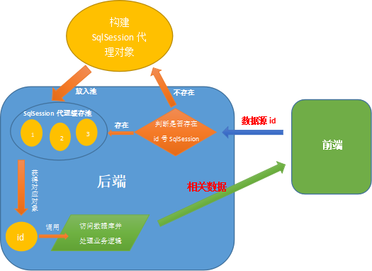
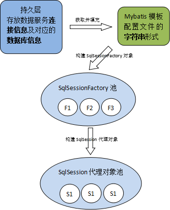

# MultiDataSrc
基于mybatis的多数据源
  
## 多数据源概述
* 来源  
用户需要访问多家供应商的库存，每家供应商库存信息可能在同一服务器下不同数据库，可能在不同服务器上，
需要进行多库存的访问。  
* 使用工具  
MyBatis框架、MySql数据库
* 作用  
开发者可配置好数据源信息，编写好访问数据库的接口（Sql Mapper），然后根据需要访问的数据库进行访问操作。


## 多数据源基本访问流程
首先，前端发送其需要访问的数据源id，然后后台判断在缓存池中是否存在对应的SqlSession代理对象。
若存在，则直接获取其对象；否则，构建完代理对象后放入缓存池中。得到代理对象后，使用其访问数据库
（获取相应的mapper访问数据库），得到的数据进行加工处理后，返回给前端。  


## SqlSession代理对象创建流程
核心：将mybatis的模板配置文件内容填充完后以字节流方式让SqlSessionFactoryBuilder去构建，创建SqlSessionFactory对象。
```
InputStream is = new ByteArrayInputStream(templateContent.getBytes());//将模板mybatis配置文件转换为字节流
SqlSessionFactory sessionFactory = new SqlSessionFactoryBuilder().build(is);//构建SqlSessionFactory对象
SqlSession sqlSession = new SqlSessionTemplate(sessionFactory);//构建SqlSession代理类
```


## 功能模块

* 数据库增删改

* 数据库服务信息管理（url仓库）

* 数据库Mapper信息管理

* 数据库启动与关闭控制

* 数据源测试-库存物料查询

* 数据库各信息查看